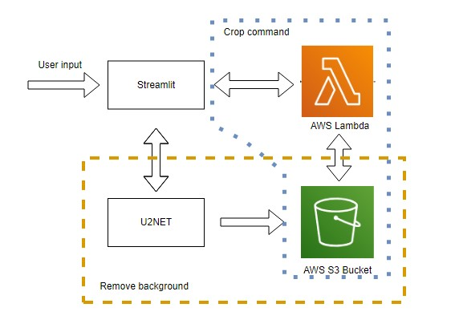

Background remover with data storage at Amazon S3 Bucket and Lambda invoking
==============================

The idea of the project is to create a model that can remove the background from an image and store it in Amazon S3 Bucket.
The user can also invoke Lambda function to crop already stored images.

Project Organization
------------

    ├── README.md          			    <- The top-level README for developers using this project.
    │
    ├── requirements.txt   			    <- The requirements file for reproducing the analysis environment, e.g.
    │                         		    		generated with `pip freeze > requirements.txt`
    │
    ├── setup.py          			    <- Makes project pip installable (pip install -e .) so src can be imported
    │
    ├── GETTING_STARTED.rst     	            <- Informations about environment and AWS configuration
    │
    ├── Project_diagram.jpg         	    <- Diagram of the project structure
    │
    ├── Streamlit_UI.png     		    <- Screenshot from executed streamlit UI
    │
    ├── src                			    <- Source code for use in this project.
    │   ├── __init__.py    			    <- Makes src a Python module
    │   │
    │   ├── saved_models           		    <- Contains model weights
    │   │   └── u2net		            <- u2net model weights dir
    │   │       ├── __init__.py    	            <- Makes src a Python module
    │   │   	└── u2net.pth		    <- u2net model weights
    │   ├── features       			    <- Scripts to handle AWS S3 buckets, Lambda functions and removing background
    │   │   ├── __init__.py			    <- Makes features a Python module
    │   │   ├── aws_client.py    		    <- Contains class that handles all AWS tasks
    │   │   └── background_removing_utils.py    <- Functions to remove background from an image
    │   │
    │   ├── streamlit_ui        		    <- Scripts to manage UI
    │   │   │── __init__.py			    <- Makes front a Python module
    │   │   ├── cropping_images_utils.py        <- Function used to crop images, handles UI
    │   │   ├── initialization.py   	    <- Initialization of session states and paths
    │   │   ├── reading_data_from_s3.py    	    <- Functions used to read data from S3, handles UI
    │   │   └── removing_background.py    	    <- Removing background, handles UI
    │   │
    │   ├── model        			    <- Contains model data
    │   │   │── __init__.py			    <- Makes model a Python module
    │   │   │── model.py			    <- Model loading
    │   │   └── u2net.py      		    <- u2net model
    │   │
    │   ├── main.py				    <- Main function
--------

<small>Project based on the <a target="_blank" href="https://drivendata.github.io/cookiecutter-data-science/">cookiecutter data science project template</a>. #cookiecutterdatascience</small>

